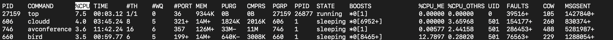

# oss_02_20253090  
# 리눅스 명령어 top, ps, jobs, kill


---


## 1. `top` 명령어: 실시간 시스템 모니터링

`top` 명령어는 시스템의 **실시간** 활동을 동적으로 보여주는 도구입니다. **CPU 사용률**, **메모리 사용률**, **프로세스 목록** 등을 지속적으로 업데이트하며 확인할 수 있어, 시스템 부하를 진단하고 비정상적인 프로세스를 식별하는 데 매우 유용합니다.

### 주요 출력 항목
| 항목 | 설명 |
| :--- | :--- |
| **PID** | 프로세스 ID (Process ID) |
| **USER** | 프로세스를 실행한 사용자 |
| **CPU** | 프로세스가 사용하는 CPU 비율 |
| **MEM** | 프로세스가 사용하는 물리 메모리 비율 |
| **VIRT** | 가상 메모리 크기 (Virtual memory size) |
| **RES** | 상주 메모리 크기 (Resident memory size, 물리 메모리 사용량) |
| **COMMAND** | 프로세스를 실행한 명령어 |

### 사용 예시
```bash
$ top
```


## 2. `ps` 명령어: 프로세스 스냅샷 확인

`ps` 명령어는 명령어가 실행된 **시점**의 프로세스 상태에 대한 **정적인 스냅샷** 정보를 보여줍니다. `top`이 실시간이라면, `ps`는 한 순간의 사진과 같습니다.

### 주요 옵션 조합
* `ps`는 다양한 옵션 조합으로 원하는 정보를 얻을 수 있습니다.
- ***ps aux*** | 시스템의 모든 사용자(a), 터미널과 관계없이 실행 중인 모든 프로세스(x), 상세정보(u)를 포시합니다. **가장 많이 사용됨**
- ***ps -ef*** | 모든 프로세스(e), 전체 포멧(f)으로 출력합니다. **BSD 스타일의 `ps aux`와 함께 자주 사용됩니다.**

### 주요 출력 항목
| 항목 | 설명 |
| :--- | :--- |
| **USER** | 프로세스를 실행한 사용자 |
| **PID** | 프로세스 ID |
| **CPU** | cpu 사용률 |
| **MEM** | 메모리 사용률 |
| **STAT** | 프로세스의 현재 상태 |
| **COMMAND** | 프로세스를 실행한 명령어 |

### 사용 예시
```bash
$ ps aux
```

```bash
$ ps -ef
```


## 3. `jobs`명령어: 백그라운드 작업 관리

`jobs`명령어는 현재 **쉘(shell)** 에서 백그라운드 또는 일지 정지 상태로 실행되고 있는 **작업(job)** 들의 목록을 보여줍니다. 작업은 쉘의 제어 하에 있는 프로세스 그룹을 의미합니다.

### 작업(Job)이란?
- 일반적으로 명령어 뒤에 **&** 를 붙여 실행하면 해당 명령어는 **백그라운드** 작업으로 실행됩니다.
- 포어그라운드(현재화면)에서 실행 중인 작업을 Ctrl + z키로 **일시 중지** 시킬 수도 있습니다.

### 주요 출력 항목
| 항목 | 설명 |
| :--- | :--- |
| **[번호]** | 쉘이 할당한 작업 번호(Job ID) |
| **+/-** | `+`는 다음번에 `fg` 또는 `bg` 명령어가 적용될 작업, `-`는 그 다음 작업 |
| **상태** | 작업의 현재 상태 |
| **명령어** | 작업에 사용된 명령어 |

### 관련 명령어
* ***fg %<번호>***: 백그라운드 작업을 **포어그라운드(Foreground)** 로 전환합니다.
* ***bg %<번호>***: 일시 중지된 작업을 **백그라운드(Background)** 로 전환합니다.

###사용예시
```bash
$ jobs
```

```bash
$ fg %1
```


